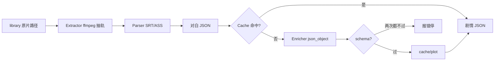

# plot

把「这部片在讲什么」做成事实源。抽软字幕 → 一次 DeepSeek JSON → 落盘。不上 Agent。

| 能力 | 干什么 |
|------|--------|
| `Extractor` | `0:s:0` 软字幕；没有轨 / 图字幕直接错 |
| `Parser` | 对白 `{start_sec, end_sec, text}` |
| `Enricher` | OpenAI SDK → DeepSeek，官方 `json_object`，不设 max_tokens |
| `Cache` | 项目根 `cache/plot/`，key = 路径+大小 |
| `HTTP` | `POST /api/plot/subtitles`、`POST/GET /api/plot/enrich` |

依赖 `library.Media` 拿当前路径。同一部片再开走缓存，不打模型。
