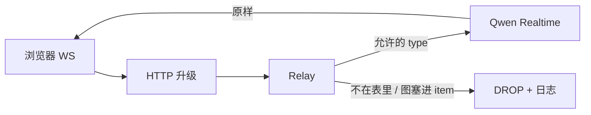

# realtime

浏览器不能拿 Key。本模块夹在中间：白名单透传事件，并打日志。不负责麦、不负责抓帧，那是前端。

| 能力 | 干什么 |
|------|--------|
| `HTTP` | `GET /api/realtime` 升级 WS；`GET /api/realtime/prompt` 返回后端陪看提示词；缺 key → 503 |
| `HTTP` | `GET /api/voices` 返回官方预置音色 + 账号克隆音色（克隆走官方接口实时拉） |
| `Relay` | 连国际站、读上限 1MB（图的 Base64 可达 256KB） |
| `types` | 客户端 allowlist；`item.create` 禁止 `input_image` |
| `voices` | 预置清单为官方音色列表快照；克隆音色用 `qwen-voice-enrollment` list 接口分页拉取 |

会话随 WS 生死：关页即 `GoingAway`，剧情 JSON 不在这里存。前端从 `/api/realtime/prompt` 取得后端模板，在 `session.update` 填当前整集剧情，跨段再 `item.create`，开口再 `image_buffer.append`。

高频流式事件（音频/转写增量）只抽样打日志：首次 + 每 50 条一次，避免刷屏。
