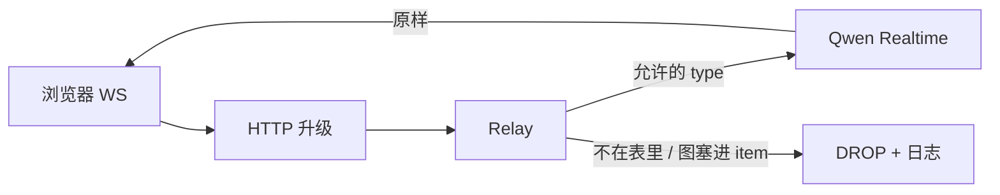

# realtime

浏览器不能拿 Key。本模块夹在中间：白名单透传事件，并打日志。不负责麦、不负责抓帧，那是前端。

| 能力 | 干什么 |
|------|--------|
| `HTTP` | `GET /api/realtime` 升级 WS；缺 key → 503 |
| `Relay` | 连国际站、读上限 1MB（图的 Base64 可达 256KB） |
| `types` | 客户端 allowlist；`item.create` 禁止 `input_image` |

会话随 WS 生死：关页即 `GoingAway`，剧情 JSON 不在这里存。前端在 `session.update` 里灌整集，跨段再 `item.create`，开口再 `image_buffer.append`。
