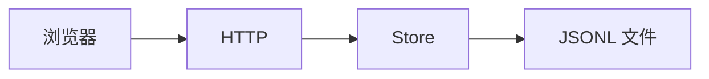

# transcript

对话记录以 JSONL 落盘到仓库根 `cache/transcript/<媒体哈希>.jsonl`。只有定稿内容（用户最终转写、AI 转录、系统事件）会写盘；流式草稿只在前端内存里。

| 能力 | 干什么 |
|------|--------|
| `Store` | `Load` / `Append` / `Clear`；key = `sha256(路径|大小)`；单文件最多保留 1000 条 |
| `HTTP` | `GET /api/transcript`、`POST /api/transcript`、`DELETE /api/transcript` |

仓库根目录定位抽在 `internal/reporoot`，与 plot cache 共用。
