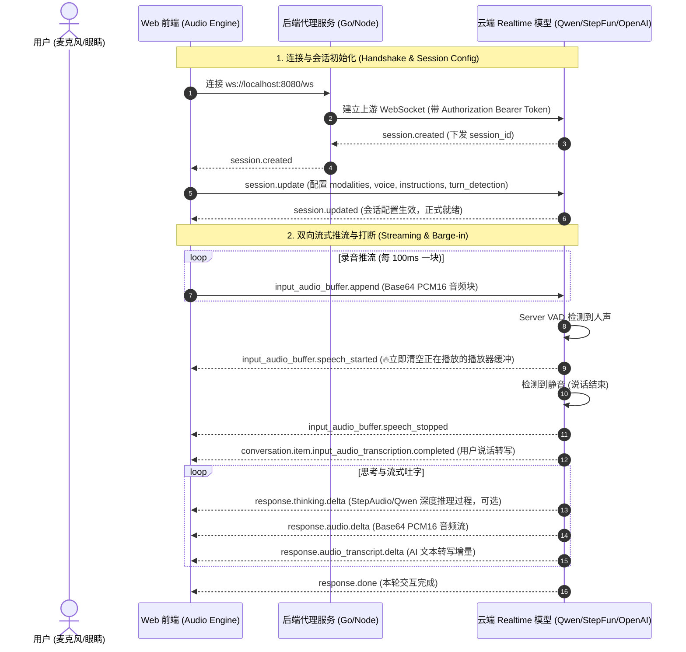

# WithYou · Realtime 实时全模态交互架构与关键决策规范

> **文档定位**：供 AI 编程助理及开发者阅读的高精度技术架构规范，详细记录了全模态 Realtime 实时双向流式协议、音频流水线、VAD 打断机制、双脑协同架构等核心决策与实现准则。

---

## 1. 核心技术选型与关键决策 (Key Architecture Decisions)

### 决策 1：纯净透明的 WebSocket 全双工流式中转代理 (Relay Proxy)
* **背景与决策**：为杜绝前端直连大模型导致的 API Key 泄露，并在局域网内提供低延迟访问，后端（Go / Node / Python）采用轻量透明的 WebSocket 中转代理。
* **协议标准**：统一遵循行业标准的 **OpenAI-Compatible Realtime WebSocket 协议规范**（与阿里通义千问 Qwen3.5-Omni Realtime、阶跃星辰 StepAudio 2.5 Realtime、OpenAI GPT-4o Realtime 100% 对齐）。
* **开发环境网络策略**：本地及局域网开发阶段采用标准 HTTP (`ws://`)，彻底摒弃自签名 HTTPS 证书（避免浏览器由于不受信任证书导致的 WebSocket 连通性阻断）。

### 决策 2：前端 24000Hz PCM16 高保真流式重采样 (Linear Resampler)
* **踩坑与核心修复**：
  * macOS / Windows 声卡硬件采样率通常固定为 `44100Hz` 或 `48000Hz`；
  * Realtime API 严格要求输入为 `24000Hz`（或 `16000Hz`）单声道 16-bit 线性 PCM（Little-Endian）；
  * 若不经重采样直接封包，会导致声音慢放严重失真变调，直接被服务端的 ASR / VAD 判定为无效噪声。
* **标准规范**：
  * 前端必须内置实时流式线性插值重采样器（`LinearResampler`），在连续音频块之间保持相位平滑连续；
  * 音频块发射周期固定为 **100ms**（即 24kHz 下收集 2400 个样本打包一次，Base64 编码发送）。

### 决策 3：浏览器 AudioContext 生命周期控制
* **标准规范**：现代浏览器安全策略会默认将新创建的 `AudioContext` 置于 `suspended` 挂起状态。必须在用户首次触发手势（如点击“开始对话”或“播放”）的回调中显式执行 `await audioContext.resume()`。

### 决策 4：双脑协同架构（System 1 快思考 + System 2 慢思考）
* **架构分工**：
  * **System 1（前台 Realtime 模型）**：作为“五官与声带”，负责百毫秒级极速拟人发音、情绪共鸣、即时打断与快节奏互动。
  * **System 2（后台高智商文本 LLM）**：作为“深层大脑”，负责异步提取长远记忆、会话压缩、剧情理解与重度决策，并在适当时机通过上下文将前情提要注入前台。

---

## 2. Realtime WebSocket 事件协议全生命周期规范



---

## 3. 标准客户端与服务端事件定义 (JSON Events Schema)

### 3.1 客户端上行事件 (Client -> Server)

#### A. 会话更新 (`session.update`)
```json
{
  "type": "session.update",
  "session": {
    "modalities": ["text", "audio"],
    "instructions": "你是幽默随性的追番搭子，喜欢二次元梗，说话带语气词与轻笑，不要机械说教。",
    "voice": "longanqian",
    "input_audio_format": "pcm16",
    "output_audio_format": "pcm16",
    "turn_detection": {
      "type": "server_vad",
      "prefix_padding_ms": 500,
      "silence_duration_ms": 500,
      "threshold": 0.5,
      "energy_awakeness_threshold": 2000
    }
  }
}
```

#### B. 音频流追加 (`input_audio_buffer.append`)
```json
{
  "type": "input_audio_buffer.append",
  "audio": "base64_encoded_pcm16_chunk=="
}
```

#### C. 插入上下文/图像 (`conversation.item.create`)
```json
{
  "type": "conversation.item.create",
  "item": {
    "type": "message",
    "role": "user",
    "content": [
      {
        "type": "input_image",
        "image_url": "data:image/jpeg;base64,/9j/4AAQSkZJRg..."
      },
      {
        "type": "input_text",
        "text": "[系统提示: 当前剧情进入高潮决战阶段]"
      }
    ]
  }
}
```

#### D. 精准裁剪上下文 (`conversation.item.delete`)
```json
{
  "type": "conversation.item.delete",
  "item_id": "item_ABC123456"
}
```

---

### 3.2 服务端下行事件 (Server -> Client)

| 事件类型 (`type`) | 关键字段 | 客户端处理规范 |
| :--- | :--- | :--- |
| `session.created` | `session.id` | 记录 Session ID，立即发送 `session.update` |
| `session.updated` | `session` | 标记会话正式就绪，开启音频发射管线 |
| `input_audio_buffer.speech_started` | `item_id` | **【瞬时打断】**立即调用 `player.clear()` 截断所有在播与排队音频 |
| `input_audio_buffer.speech_stopped` | `item_id` | 标记用户停止发声，进入 AI 思考状态 |
| `conversation.item.input_audio_transcription.completed` | `transcript` | 渲染用户气泡，存入本地历史记录 |
| `response.thinking.delta` | `delta` | 渲染流式思考气泡（深度推理过程） |
| `response.audio.delta` | `delta` | 解码 Base64 PCM16，送入 Web Audio 播放排队队列 |
| `response.audio_transcript.delta` | `delta` | 流式打字机渲染 AI 说话文本 |
| `response.done` | `response` | 本轮结束，重置思考状态 |
| `error` | `error.message` | 记录错误日志，执行重试或界面提示 |

---

## 4. 前端音频工程流水线实现规范 (Web Audio Pipeline)

### 4.1 麦克风采集与下采样 (`AudioRecorder`)
```typescript
// 1. 获取麦克风（开启回声消除与降噪）
const stream = await navigator.mediaDevices.getUserMedia({
  audio: { channelCount: 1, echoCancellation: true, noiseSuppression: true, autoGainControl: true }
});

// 2. 初始化 AudioContext 并显式唤醒
const context = new (window.AudioContext || (window as any).webkitAudioContext)();
if (context.state === "suspended") {
  await context.resume();
}

// 3. 构建高精度线性插值重采样器 (任意输入采样率 -> 24000Hz)
const resampler = new LinearResampler(context.sampleRate, 24000);
```

### 4.2 低延迟流式排队播放与瞬时打断 (`AudioPlayer`)
```typescript
// 播放器维护 nextPlayTime 时间轴
let nextPlayTime = context.currentTime;
const activeSources = new Set<AudioBufferSourceNode>();

function appendPCM16(base64Data: string) {
  const pcm16 = base64ToInt16(base64Data);
  const float32 = pcm16ToFloat(pcm16);
  const buffer = context.createBuffer(1, float32.length, 24000);
  buffer.getChannelData(0).set(float32);

  const source = context.createBufferSource();
  source.buffer = buffer;
  source.connect(analyser);

  const now = context.currentTime;
  if (nextPlayTime < now) {
    nextPlayTime = now + 0.01; // 10ms Jitter Buffer
  }
  source.start(nextPlayTime);
  nextPlayTime += buffer.duration;

  activeSources.add(source);
  source.onended = () => activeSources.delete(source);
}

// 瞬时打断（用户开口时调用，0延迟静音）
function clear() {
  for (const src of activeSources) {
    try { src.stop(); src.disconnect(); } catch {}
  }
  activeSources.clear();
  nextPlayTime = context.currentTime;
}
```
