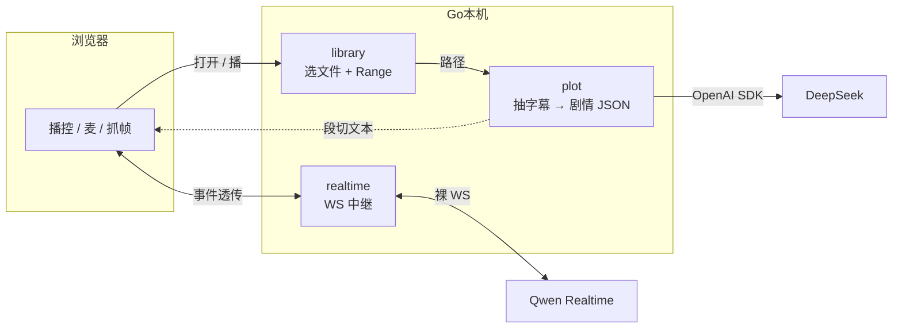

# WithYou V0 计划

本机 Web：打开一部带软字幕的番，AI 看着同一帧听你吐槽，不剧透、不瞎编。

浏览器是媒体运行时。Go 是本机 OS：路径、ffmpeg、Key、中继。视频不上传。

---

## 三块

| 包 | 能力 | 验证 |
|----|------|------|
| `backend/internal/library` | 系统选框拿路径；`/media` Range | 点打开，能播 |
| `backend/internal/plot` | ffmpeg 抽软字幕 → 解析 → DeepSeek 一次 JSON → hash 缓存 | 看到剧情 JSON |
| `backend/internal/realtime` | 浏览器 ↔ Qwen，客户端 type 白名单 | `session.update` 打通 |

包内：`module.go` + 能力文件 + `types.go`。`Module` 只组装，业务挂能力上。一个包一个 `New`。

前端：`frontend/` Vite + TS，无框架。事件名与 `backend/internal/realtime/types.go` 同一份。

---

## 喂模型

| 什么 | 哪条事件 |
|------|----------|
| 人设 + 防剧透 | 开场一次 `session.update.instructions` |
| 总览 / 跨段 / 快进 / 倒退 | `conversation.item.create` + `input_text` |
| 开口前 500ms 画面 | `input_image_buffer.append` |
| 你说话 | `input_audio_buffer.append`（VAD 自动收，不自己 commit） |

合同：`docs/ws-events.md`。不在表里的客户端 type 拒掉。  
`item.create` 被拒：**报错停下**，不改 `instructions` 兜底。

音频：24k PCM 进、24k PCM 出。不设 `idle_timeout_ms`。

---

## 不做

外挂/硬字幕、用户记忆、Agent、厂商 Realtime SDK、Gin、Wails、整片上传。

---

## 顺序

一次一块，验证再下一块。

1. config + library → 打开并能播（骨架已落地：`POST /api/open`、`GET /media`；Range 有测试。选框需本地点按钮验证）  
2. plot 抽轨 + 解析 → 对白 JSON  
3. plot 富化 + 缓存 → 剧情 JSON  
4. realtime 中继 → 会话握手  
5. 前端麦 / 抓帧 / 段切注入  
