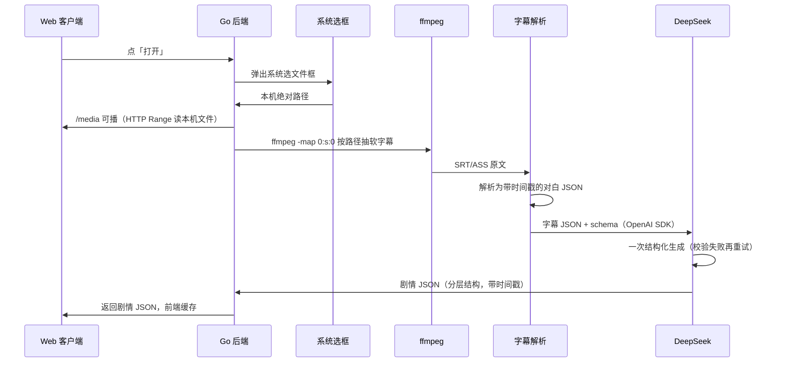
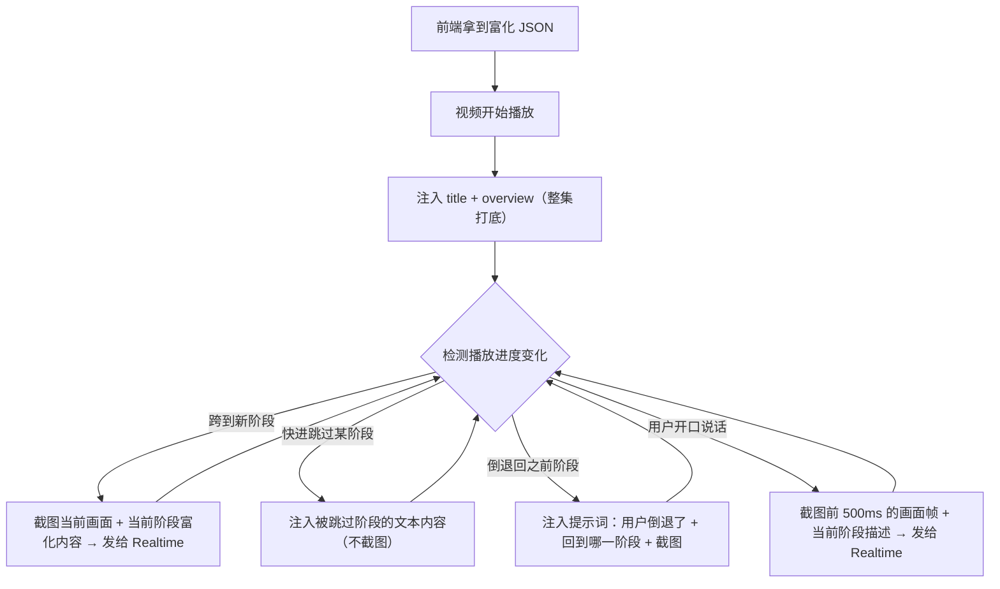

# WithYou · 交接文档

> 项目整体技术方案文档，供开发者和 AI 编程助理理解全貌。
> V0 拍板结论与 `docs/DIRECTION.md` 对齐（见第三节）。

---

## 一、预处理阶段（离线）

用户在前端点「打开」，Go 弹出系统选文件框，拿到本机真实路径后触发。一次性完成，不做实时处理。**视频不上传**；抽轨、解析、富化全在 Go。浏览器只通过 `/media` Range 播放这个本机文件，并监听进度 / 麦克风。

### 流程总览



### 各阶段职责

| 组件 | 职责 |
|------|------|
| **Web 客户端** | 点打开、用 `/media` 播本机视频、进度监听、麦克风、抓帧。不解析字幕、不调 LLM、不上传文件 |
| **Go 后端** | 弹选框拿路径 → ffmpeg 抽轨 → 解析字幕 → OpenAI SDK 调 DeepSeek → 缓存并返回剧情 JSON；同时 Range 提供 `/media`；Realtime 中继 |
| **ffmpeg** | `ffmpeg -map 0:s:0` 按本机路径抽出软字幕轨 |
| **字幕解析** | 将抽出的 SRT/ASS 解析为带时间戳的对白 JSON |
| **DeepSeek** | 一次按 schema 吐出结构严格的剧情 JSON；校验失败再重试。V0 不上 Agent、不上工具调用、不上用户记忆 |

### 剧情 JSON 输出结构

```json
{
  "title": "作品标题",
  "overview": {
    "grand_summary": "整集两三句话的总览",
    "key_characters": ["本集关键角色"],
    "key_plot_points": ["本集关键情节"]
  },
  "major_segments": [
    {
      "start_sec": 0,
      "end_sec": 300,
      "title": "大阶段标题",
      "summary": "大阶段整体发生了什么",
      "sub_segments": [
        {
          "start_sec": 0,
          "end_sec": 150,
          "beat": "节拍标题",
          "summary": "具体剧情，3~5 句，谁对谁做了什么",
          "key_dialogue": "最关键的一句台词（原文）",
          "visual_scene": "画面真实意象（场景/光线/动作/构图）",
          "character_motivation": "角色动机（世界知识补全）",
          "emotion": "情感基调",
          "story_so_far": "进入本小阶段前已发生的关键剧情积累",
          "spoilers_avoided": "本阶段绝不能提前透露的后续剧情"
        }
      ]
    }
  ]
}
```

### V0 明确不做

| 项 | 说明 |
|----|------|
| 外挂字幕 / 硬字幕 / 无字幕裸片 | 后置为适配器。V0 只吃内嵌软字幕轨 |
| 完整 Agent / 多轮工具调用 | 一次结构化生成 + schema 失败重试 |
| 用户记忆 `memory_load` | 人设写死在系统提示里，记忆整套 V1 再说 |

---

## 二、实时阶段（播放时）

前端拿到预处理返回的富化 JSON 后，视频播放过程中实时将剧情上下文 + 画面帧注入 Realtime API。

### 注入时机与行为



### 各触发点详解

| 触发事件 | 行为 | 注入内容 | 截图 |
|---------|------|---------|------|
| **播放开始** | 打底上下文 | `title` + `overview`（总览 + 角色 + 关键情节） | 不截 |
| **跨到新剧情段** | 阶段切换 | 当前 `sub_segment` 的 summary / visual_scene / emotion | 截当前帧 |
| **快进（跳过某阶段）** | 补跳过内容 | 被跳过阶段的 summary（纯文本，不截图） | 不截（画面无意义） |
| **倒退（回到之前阶段）** | 重置上下文 | 提示词："用户倒退了，现在回到了 X 阶段" + 阶段内容 | 截当前帧 |
| **用户开口说话（VAD）** | 按需抓帧 | 当前阶段的描述 + 500ms 前的画面帧 | 截前 500ms |

### 抓帧策略：为什么是 500ms 前

用户开口往往是在情绪触发后数百毫秒 —— 爆炸、名场面、角色变脸的瞬间已经过去了 500ms。抓当前帧只会拍到"事后静态画面"，而抓前 500ms 能拍到**真正触发用户反应的那个瞬间**。

前端实现：维护一个滚动环形缓冲（持续存最近 2~3 帧），`speech_started` 触发时从缓冲里取出 500ms 前的帧。

---

## 三、关键技术决策

> 详见 `docs/DIRECTION.md`，此处列出核心结论。

1. **Realtime 模型**：Qwen3.5-Omni-Plus-Realtime，国际站 `dashscope-intl.aliyuncs.com`
2. **音频协议**：对齐 OpenAI-Compatible Realtime WebSocket 协议；图像走 Qwen 专属扩展 `input_image_buffer.append`
3. **富化模型**：DeepSeek（V4-Flash 或同级文本模型），一次结构化生成，schema 失败再重试
4. **输入限制**：V0 仅接受带软字幕轨的视频，Go 按本机路径 `ffmpeg` 提取；硬字幕/外挂字幕后置为适配器
5. **注入策略**：开场灌本集完整剧情 JSON；跨段再灌当前节；开口前 500ms 抓帧。本集剧透不卡，要跟上播放进度
6. **防幻觉**：剧情 JSON 作为事实源，不允许自编没发生过的互动；不设 known_until
7. **职责切分**：前端只播控 / 抓帧 / 音频；选文件、抽轨、解析、富化、Realtime 中继全在 Go。视频不上传。代码在 `backend/` 与 `frontend/`
8. **V0 不上用户记忆**：人设写死在系统提示，跨集偏好/历史以后再做
9. **调用约定**：LLM 富化走 OpenAI SDK（DeepSeek 兼容口）；Realtime 自己写 WS 事件，不用厂商 Realtime SDK。前后端事件类型必须同一份规格定义
10. **前端**：Vite + TypeScript，无框架
