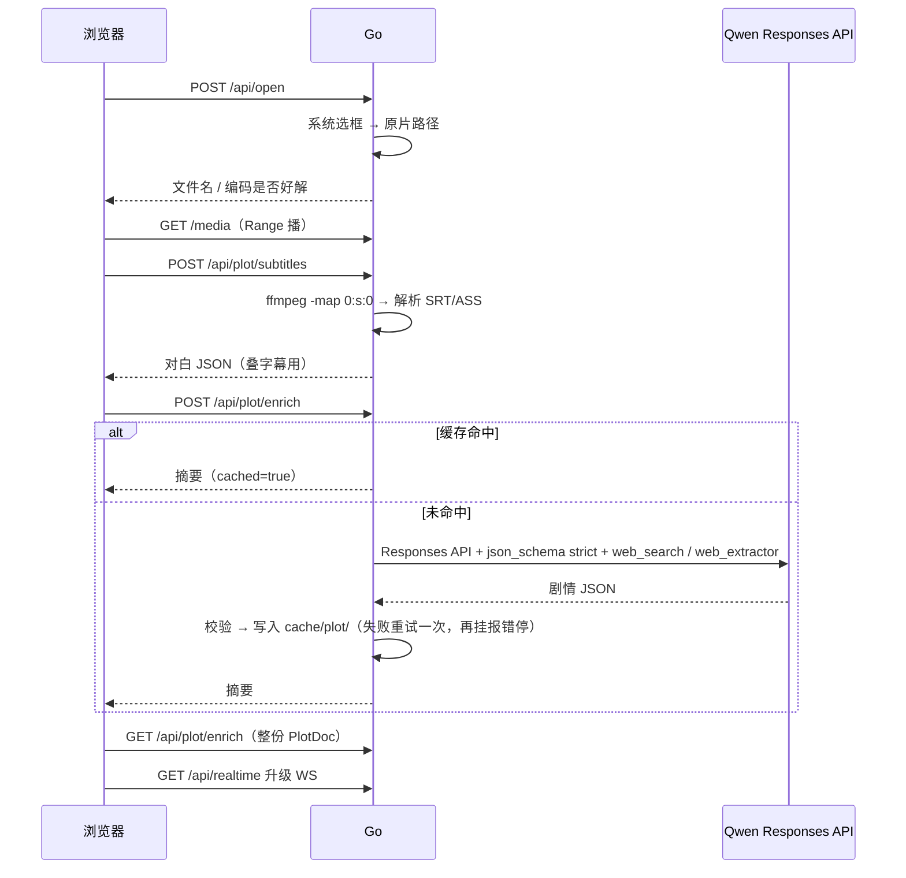
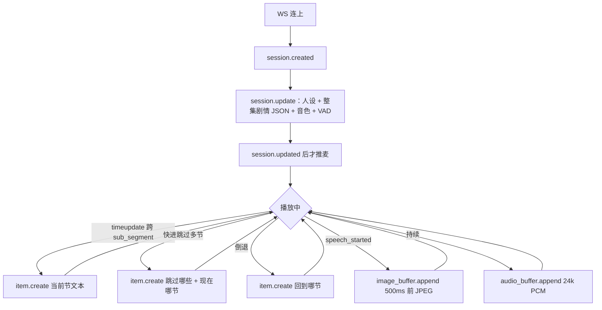

# WithYou · 交接文档

> 给开发者和下一任 AI 的「一眼懂」文档。先读本文，再读 `docs/ws-events.md`（WS 事件合同）和各包 `README.md`。原 `docs/DIRECTION.md`、`docs/V0计划.md` 已糅合进本文并删除。

**产品**：本机看番陪伴。打开带软字幕的 mkv/mp4，AI 和你看同一时间轴——开口前约 500ms 的画面、当前剧情节拍、整集剧情 JSON。不是旁边挂个聊天框。

**三条设计原则**：

1. 本集剧透不卡；要卡住的是「现在播到哪」和「不许瞎编没发生过的互动」。
2. 剧情 JSON 是唯一事实源，AI 不靠训练记忆编剧情。
3. Realtime 是「五官 + 秒回」，复杂认知放离线富化；上下文必须跟上播放进度。

---

## 0. V0 现状（2026-08-20）

已跑通一整条：打开 → 播 → 叠字幕 → 抽对白 → Qwen 富化剧情 JSON（可走磁盘缓存）→ Realtime 多轮开口有图有回 → 对话记录落盘 → 换音色。

| 能力 | 状态 |
|------|------|
| 选本机文件 + `/media` Range 播 | ✅ |
| ffmpeg 抽软字幕 + 解析 + 画面叠字 | ✅ |
| Qwen Responses API 富化（strict JSON Schema + 联网搜索）+ `cache/plot/` | ✅ |
| Go WS 中继 + 前端麦 / 段切文本 / 开口塞图 | ✅ |
| 音色可选（官方 56 个 + 账号克隆音色） | ✅ |
| 对话记录 JSONL 落盘 + 刷新恢复 + 清空 | ✅ |
| Realtime 高频日志降噪 | ✅ |
| 跨段也截一帧给模型 | ❌ 后期，现在只在开口塞图 |
| 用户记忆 / 跨集续聊（recap 压缩） | ❌ 后期，方向已定 |

关页 = Realtime 会话结束（日志 `GoingAway`），剧情 JSON 和对话记录还在磁盘。再开是新会话，整集事实会再灌一遍，**上一轮对话目前不记得**（只恢复显示，模型上下文已重置）。

---

## 1. 架构总览

```text
浏览器（Vite + TS，只负责播控 / 麦 / 抓帧 / 字幕 / 面板）
   │  24k PCM 音频 + 开口前 500ms JPEG + 剧情文本 item
   ▼
Go 本机（选文件 / 抽字幕 / 富化 / Realtime 中继 / 对话记录）
   │  裸 WS：音频事件对齐 OpenAI-compatible，图走 Qwen input_image_buffer.append
   ▼
Qwen3.5-Omni-Plus-Realtime（国际站）
```

浏览器不能拿 API Key，也不上传视频。Go 夹在中间：选文件拿本机路径、`/media` Range 读盘、`ffmpeg` 抽软字幕、调富化模型、转发 Realtime WS。Key 只活在本机进程里。

**双脑分工**：

- Realtime = 五官 + 秒回：看画面、听你说话、流式回复。
- 离线富化 = 大脑事实源：字幕 → 剧情 JSON，开场灌整集，段切再灌当前节。

**目录**：

```text
backend/cmd/server            组装 library + plot + realtime + transcript
backend/internal/config       环境变量，启动时读一次，无行为
backend/internal/library      系统选框 + /media Range + 当前文件 state
backend/internal/plot         ffmpeg 抽轨 → 对白 → Qwen 富化 → cache/plot
backend/internal/realtime     浏览器 ↔ Qwen WS 中继（+ 音色列表）
backend/internal/transcript   对话记录 JSONL Store + HTTP
backend/internal/reporoot     仓库根定位，plot / transcript 共用
frontend/                     Vite + TS，无框架
cache/plot/                   剧情 JSON 落盘（gitignore）
cache/transcript/             对话记录 JSONL 落盘（gitignore）
docs/ws-events.md             WS 事件合同，客户端 type 白名单
```

工程约定：每个 `internal/*` 包 = `module.go` 组装器 + 能力文件 + `types.go`，一个 `New`；禁止隐式兜底，失败就报错停。

---

## 2. 怎么跑

```text
cd backend && go run ./cmd/server      # 127.0.0.1:8080
cd frontend && npm install && npm run dev   # 127.0.0.1:5173
```

`.env` 在**项目根**（`config.Load` 会读 `.env` 和 `../.env`）。可复制 `.env.example` 为 `.env`：

- `QWEN_API_KEY` 或 `DASHSCOPE_API_KEY`（必须与 `QWEN_SITE` 对应，国内站 / 国际站 key 不通用）
- `WITHYOU_ADDR`（默认 `127.0.0.1:8080`）
- `QWEN_SITE`（`intl` 国际站或 `cn` 国内站，默认 `intl`）
- `QWEN_PLOT_MODEL`（默认 `qwen3.8-max`，富化用）
- `QWEN_REALTIME_MODEL`（默认 `qwen3.5-omni-plus-realtime`）
- `QWEN_REALTIME_VOICE`（默认 `Tina`）
- `QWEN_PLOT_BASE_URL_INTL` / `QWEN_PLOT_BASE_URL_CN`（剧情富化 Responses API）
- `QWEN_REALTIME_URL_INTL` / `QWEN_REALTIME_URL_CN`（Realtime WebSocket）
- `QWEN_VOICE_API_URL_INTL` / `QWEN_VOICE_API_URL_CN`（声音复刻接口）

国内站与国际站的 API Key 不通用，切换 `QWEN_SITE` 时要同步使用对应站点的 Key。

缺 Realtime key 时服务仍能起来，升级 WS 时再 503。日志：Go `realtime … type=… bytes=…`；浏览器控制台 `[withyou]`。

---

## 3. 核心链路

### 3.1 离线（打开时跑一次，全在 Go）



没有软字幕轨 / PGS 图字幕：**报错停**，不 OCR。

### 3.2 实时（V0 实际行为）



喂给模型的通道：

| 什么 | 事件 |
|------|------|
| 人设 + 本集完整剧情 | 开场一次 `session.update.instructions` |
| 总览 / 跨段 / 快进 / 倒退 | `conversation.item.create` + `input_text` |
| 开口前 500ms 画面 | `input_image_buffer.append` |
| 你说话 | `input_audio_buffer.append`（VAD 自动收，不自己 commit） |

音频：24k PCM16 进、24k PCM 出。VAD：`semantic_vad` + `threshold 0.5` + `prefix_padding_ms 500` + `silence_duration_ms 800`，显式开启 `create_response` / `interrupt_response`。显式开启 `input_audio_transcription`（`qwen3-asr-flash-realtime`）。**不要设 `idle_timeout_ms`**（安静看番会被它找话聊）。

抓帧：前端每 250ms 抓一帧进环形缓冲，只有 `speech_started` 才上传；取开口前约 500ms 那帧。编码：最长边先 720p，压到原图 ≤192KB 且 Base64 ≤256KB。AI 说话时用户开口会清掉浏览器本地排队音频；云端响应仍在生成时再发 `response.cancel`（barge-in）。AI 音频在浏览器端先做 160ms 预缓冲，再按连续时间轴排入 Web Audio，吸收网络抖动；发生断粮时记录 `audio playback underrun`。

---

## 4. 已拍板（不要默默改）

| 决策 | 结论 |
|------|------|
| 形态 | 本机 Web，不是网盘。视频不上传 |
| 输入 | V0 **只吃内嵌软字幕轨**（mkv 内挂最稳）。硬字幕 / 外挂 / 裸片后置 |
| 选文件 | 浏览器拿不到真路径 → Go 弹系统选框 |
| 播放 | `<video src="/media">`，Go Range 读盘，浏览器解码 |
| 不转码 | HEVC / 10bit Chrome 经常只有声音，标出来即可 |
| 富化 | Qwen + **OpenAI Go SDK**（Responses API）；`text.format = json_schema + strict`；服务端挂 `web_search` / `web_extractor`；失败再试一次，再挂就报错停 |
| Realtime | 自己写 WS 中继，不用厂商 Realtime SDK |
| 图 | 只能 `input_image_buffer.append`。禁止 `conversation.item.create` 塞 `input_image`（实测掐连接） |
| 图体积 | JPEG；原图 ≤192KB；Base64 ≤256KB；推荐 ≤720p；**发送**每秒最多 1 张 |
| 开口抓帧 | 环形缓冲，取 **开口前 ~500ms**，不是当前帧 |
| 跨段 | **只推文本** `item.create`（当前节 / 快进补跳过 / 倒退）。跨段再截图 = 后期 |
| 剧透 | 开场灌**整集**剧情 JSON。不设 `known_until` |
| 失败 | 无隐式兜底。`item.create` 被拒就报错，不准改成改 `instructions` |
| 会话 | 一次 WS = 一次会话。关页丢失实时上下文；剧情 / 对话记录按「路径+大小」缓存 |
| 对话记录 | 定稿内容落盘 `cache/transcript/<媒体哈希>.jsonl`；流式草稿只在内存；刷新恢复显示，模型上下文重置有提示 |
| 音色 | 切换只发 `session.update` + `{session:{voice}}`，不重开会话 |
| 工程 | `net/http`；包内 `module.go` + 能力文件 + `types.go`；一个 `New` |
| 前端 | Vite + TS，不上 React/Vue |

---

## 5. 剧情 JSON schema

```json
{
  "title": "作品标题",
  "overview": {
    "grand_summary": "整集两三句话的总览",
    "key_characters": ["本集关键角色"],
    "key_plot_points": ["本集关键情节"]
  },
  "major_segments": [
    {
      "start_sec": 0,
      "end_sec": 300,
      "title": "大阶段标题",
      "summary": "大阶段整体发生了什么",
      "sub_segments": [
        {
          "start_sec": 0,
          "end_sec": 150,
          "beat": "节拍标题",
          "summary": "具体剧情，3~5 句",
          "key_dialogue": "最关键一句（原文）",
          "visual_scene": "画面意象",
          "character_motivation": "角色动机",
          "emotion": "情感基调",
          "story_so_far": "进入本拍前已发生的",
          "spoilers_avoided": "字段仍在；V0 开场已灌整集，不靠它卡剧透"
        }
      ]
    }
  ]
}
```

Death Note 01 实测：结构可用；热门番会吃训练知识。字段可能中英混（prompt 里有英文 EXAMPLE JSON）。产品优先「上下文跟上」，不优先去英文化。

---

## 6. 事件与协议坑（必读）

合同：`docs/ws-events.md`。客户端不在表里的 `type`：**DROP + 日志，不转发**。

硬坑：

1. 图必须走 `input_image_buffer.append`，不能塞进 `conversation.item.create`（实测掐连接）。
2. 发图前本轮至少有过 `input_audio_buffer.append`。
3. coder/websocket **默认读 32KB**；图的 JSON 常 30–60KB+ → 会 `1009 message too big`。中继已 `SetReadLimit(1MB)`。
4. 官方图：JPEG；Base64 ≤256KB；建议原图 ≤190–192KB。
5. `item.create` 被拒不要改写成 `session.update` 兜底。
6. 高频流式事件（`input_audio_buffer.append`、`response.audio.delta`、转写 delta 等）只抽样打日志：首次 + 每 50 条一次；关键事件（session、speech、image、error）完整打印。`session.created` 会带 `session_id` 打出来，`error` 会带 `code/msg`。

---

## 7. HTTP 一览

| 方法 | 路径 | 作用 |
|------|------|------|
| POST | `/api/open` | 系统选框，记下路径 |
| GET/HEAD | `/media` | Range 读当前原片 |
| GET | `/api/current` | 当前文件名（不含路径） |
| POST | `/api/plot/subtitles` | 抽轨解析 |
| GET | `/api/plot/subtitles` | 上次对白 |
| POST | `/api/plot/enrich` | 富化（可 cached） |
| GET | `/api/plot/enrich` | 整份 PlotDoc |
| GET | `/api/realtime` | WS 升级 |
| GET | `/api/voices` | 预置音色 + 账号克隆音色（克隆走官方接口实时拉） |
| GET | `/api/transcript` | 当前媒体对话记录（JSONL） |
| POST | `/api/transcript` | 追加一条定稿记录 |
| DELETE | `/api/transcript` | 清空当前媒体记录 |

---

## 8. 对话记录、音色、日志（2026-08-20 新增）

### 8.1 对话记录（transcript）

后端 `internal/transcript`：`Store` 提供 `Load / Append / Clear`，文件 key = `sha256(路径|大小)`，目录 `cache/transcript/`，单文件读取时最多保留最近 1000 条。仓库根定位抽在 `internal/reporoot`，与 plot cache 共用。

JSONL 每行一个 Entry（我们自己归一化的格式，不是官方原样）：

```json
{"id":"tr_xxx","kind":"user","text":"夜神月好像根本不想和其他人玩。","detail":"","status":"done","at":1787194172611}
```

- `kind`：`user` / `ai` / `event`（剧情灌注、剧情更新、截图已发送、音色切换等）
- `text`：user/ai 取官方 `transcript`；event 是我们自己的 label
- `status`：`done` / `interrupted`
- 只有**定稿**内容落盘（用户最终转写、AI 完整或被打断转录、系统事件）；流式草稿只在前端内存

前端右侧「对话记录」面板：用户/AI 气泡 + 系统小字，流式更新自动滚底，带清空按钮。打开视频时 `GET` 恢复历史，刷新后加一条不落盘的「已恢复历史记录，模型上下文已重置」提示。

### 8.2 前端陪看门禁与状态 UI

- 陪看默认要求用户手动确认已连接耳机；这是浏览器可靠可用的门禁，不伪装成硬件自动检测。视频仍可先打开，但只有确认后才建立 Realtime、启用麦克风。
- 右侧栏控制在 `320px` 内，给状态卡留出更完整的展示空间；对话记录、音色、剧情「现在看到哪」都是默认收起的可访问折叠面板。
- 对话记录展开后由 `.transcript-list` 自己承担滚动，固定可视高度并隔离 overscroll，不能依赖整个侧栏滚动。
- Realtime 用一个状态小球表达当前状态：`listening` 跳动，`speaking` 变暗，`thinking` / `muted` / `offline` 降亮度。用户可以单独静音麦克风。
- Realtime 基础人格唯一存于 `backend/internal/realtime/prompt.go`，前端通过 `GET /api/realtime/prompt` 获取模板，只填入 `{{PLOT_JSON}}`；不要在前端复制人格原文。
- `RealtimeWatch.unlockAudio()` 必须在用户点击开始陪看时调用，提前解锁播放和录音 `AudioContext`；`start()` 会保留这两个上下文，避免异步 WS 回调被浏览器自动播放策略挂起。
- `session.updated` 既可能来自首次会话配置，也可能来自切换音色；只有第一次打开麦克风和抓帧，后续更新只刷新配置，不能重复创建采集链。
- 主题使用 `html[data-theme]` + 语义 CSS Token，首次跟随系统，手动切换结果保存在浏览器 `localStorage` 的 `withyou-theme`。
- 视觉组件避免堆叠技术胶囊和渐变，折叠、主题、耳机、麦克风图标统一使用 `lucide`，图标由 `main.ts` 集中初始化。

### 8.3 音色

`GET /api/voices` 返回 `default_voice` + `preset`（官方预置音色快照，56 个）+ `custom`（当前账号克隆音色，实时调 `qwen-voice-enrollment list` 分页拉取，带 `target_model`）+ 可选 `custom_error`。官方音色列表页面：`https://help.aliyun.com/zh/model-studio/omni-voice-list`（快照日期 2026-05-22）。

前端音色下拉分「官方音色 / 我的音色」，切换只发 `session.update` + `{session:{voice}}`，不重开会话、不丢对话。

---

## 9. 已知边界（官方文档 2026-08）

Qwen3.5-Omni-Realtime 的使用限制，做长会话 / 长片必读：

- **单次会话最长 120 分钟**，达到上限服务主动关闭连接。
- 上下文超过限制时**自动丢弃更早的历史**（静默，无报错）。

| 模型 | 音频最大轮次 | 视频最大轮次 | 音频最大时长 | 视频最大时长 |
|------|------|------|------|------|
| qwen3.5-omni-plus-realtime | 100 轮 | 50 轮 | 600 秒 | 240 秒 |
| qwen3.5-omni-flash-realtime | 80 轮 | 50 轮 | 480 秒 | 120 秒 |
| qwen3-omni-flash-realtime | 8 轮 | 8 轮 | — | — |

对我们这个用法：每开口一次发一张图 = 一次「视频轮」，**约 50 轮后最早的历史开始被丢**；2 小时电影刚好擦 120 分钟上限，3 小时电影必须切会话。

Token 换算（做监控 / 成本时用）：

- 音频输入：`秒数 × 7` tokens；音频输出：`秒数 × 12.5` tokens（Qwen3.5-Omni-Realtime 系列）
- 图片：每 `32×32` 像素 = 1 token（plus），单图最少 4、最多 1280；我们的 1280×720 = 920 tokens
- 上下文：最大输入 196,608 / 最大输出 65,536 / 窗口 262,144；限流 TPM 100K、RPM 60

---

## 10. 验证记录（实测）

### 10.1 图像注入链路 ✅

- 说话时 `input_image_buffer.append` 推 JPG → VAD 自动提交 → 模型「看到」画面并回答。
- 图片合规：必须 JPG；原始 ≤190KB / base64 ≤256KB；发图前至少一次 `input_audio_buffer.append`。
- `conversation.item.create` 塞 `input_image` 服务端直接拒绝（掐断连接），必须走 `input_image_buffer.append`。

### 10.2 裸模型能力（零剧情背景，仅单帧 + 人设）

| 能力 | 结果 |
|------|------|
| 画面表层理解（人/表情/氛围/动作） | ✅ 强 |
| 字幕 OCR + 语境推断 | ✅ 意外地强 |
| 认角色（热门番，特征明显） | ✅ 能 |
| 认角色（多角色/冷门新番） | ⚠️ 会垮，角色关系张冠李戴 |
| 多轮记忆 + 人设一致性 | ✅ 优秀 |
| 首字延迟 | ✅ 约 1.6s |

### 10.3 关键翻车点（已变成设计约束）

- **裸模型会自信编造具体剧情**（问「哪一集」编出幻觉集数）→ 必须用真实剧情 JSON 注入约束。
- 冷门 / 新番识别差 → 靠字幕 + 富化补世界知识，联网搜索 / Agent 后置。
- 国内站 / 国际站 key 不通用 → 统一国际站 `dashscope-intl`。

---

## 11. 后期（未做，别当 V0 缺了就补错）

1. **用户记忆 / 跨集续聊**（方向已定）：把定稿 transcript 过滤掉事件噪音 → 用便宜模型压缩成「观感回顾」（用户聊过什么、立场、停在哪）→ 新会话开场注入一条 user 消息 + 当前段 PlotDoc。**只压缩增量，剧情本体不动**，剧情仍走 PlotDoc。
2. **上下文用量监控**：记 `response.done.usage.input_tokens`，接近上限预警；把 `error` / `incomplete` 当「可能爆了」处理。
3. 跨段再截一帧（与开口抓帧错开 1 张/秒）。
4. 外挂字幕 / 硬字幕 / ASR。
5. HEVC 转码或系统扩展说明。
6. prompt 全中文输出。

**明确不做**：外挂/硬字幕（V0）、厂商 Realtime SDK、Agent、Gin/Wails、整片上传。

---

## 12. 工程口味

- 模块 = 组装器 + 小能力，禁止隐式兜底，失败报错停。
- Go 标准库 `net/http`；`coder/websocket` 只当传输，不当厂商 SDK。
- 前端 Vite + TS 无框架，事件名与 `backend/internal/realtime/types.go` 同一份。
- 文档必须与代码事实一致，改代码同步改交接文档。
