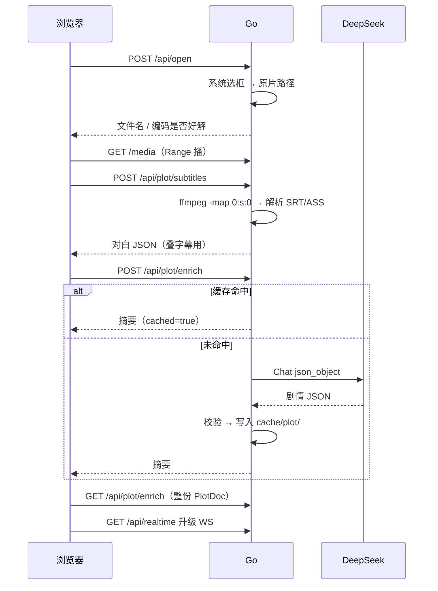
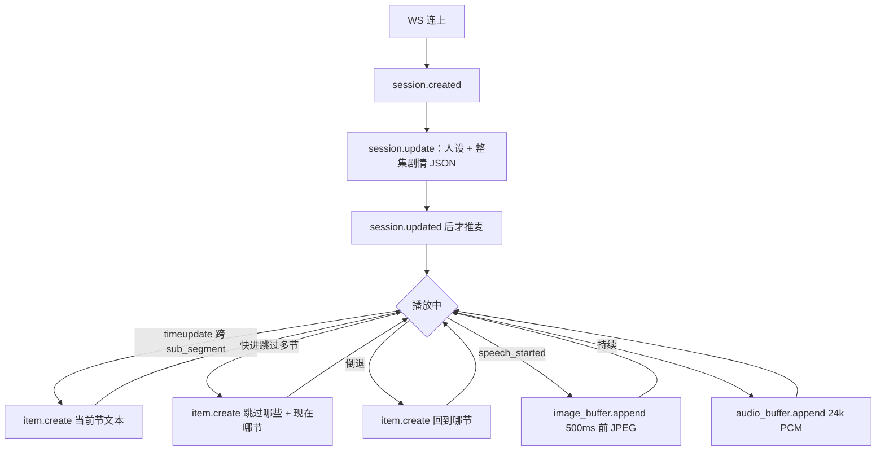

# WithYou · 交接文档

> 给开发者和下一任 AI：**V0 已出炉**。先读本文 + `docs/ws-events.md` + 各包 `README.md`。认知/验证过程见 `docs/DIRECTION.md`，计划清单见 `docs/V0计划.md`。

**产品**：本机看番陪伴。打开带软字幕的 mkv/mp4，AI 和你看同一时间轴——开口前约 500ms 的画面、当前剧情节拍、整集剧情 JSON。不是旁边挂个聊天框。

**本集剧透不卡。** 要卡住的是「现在播到哪」和「不许瞎编没发生过的互动」。

---

## 0. V0 现状（2026-08-19，Death Note 01 实锤）

已跑通一整条：打开 → 播 → 叠字幕 → 抽 327 条对白 → DeepSeek 4 段 / 11 节（可走磁盘缓存）→ Realtime 多轮开口有图有回。

| 步 | 状态 |
|----|------|
| 选本机文件 + `/media` Range 播 | ✅ |
| ffmpeg 抽软字幕 + 解析 + 画面叠字 | ✅ |
| DeepSeek 官方 JSON Output 富化 + `cache/plot/` | ✅ |
| Go WS 中继 + 前端麦 / 段切文本 / 开口塞图 | ✅ |
| 跨段也截一帧给模型 | ❌ 后期优化，现在只在开口塞图 |

关页 = Realtime 会话结束（日志 `GoingAway`），剧情 JSON 还在磁盘。再开是新会话，整集事实会再灌一遍，**上一轮对话不记得**。

---

## 1. 仓库与怎么跑

```
backend/cmd/server          组装 library + plot + realtime
backend/internal/config     环境变量（每包有 README + 心智图）
backend/internal/library    选文件 + 播
backend/internal/plot       字幕 → 剧情 JSON
backend/internal/realtime   浏览器 ↔ Qwen 中继
frontend/                   Vite + TS，无框架
cache/plot/                 剧情 JSON 落盘（gitignore）
docs/ws-events.md           事件合同，客户端 type 白名单
```

```text
cd backend && go run ./cmd/server          # 127.0.0.1:8080
cd frontend && npm run dev                 # 127.0.0.1:5173
```

`.env` 在**项目根**（`config.Load` 会读 `.env` 和 `../.env`）：

- `DEEPSEEK_API_KEY` / `DEEPSEEK_MODEL`（默认 `deepseek-v4-flash`）
- `QWEN_API_KEY` 或 `DASHSCOPE_API_KEY`（国际站）
- Realtime：`wss://dashscope-intl.aliyuncs.com/api-ws/v1/realtime`，模型 `qwen3.5-omni-plus-realtime`

国内站会 401。日志：Go `realtime … type=… bytes=…`；浏览器控制台 `[withyou]`。

---

## 2. 已拍板（不要默默改）

| 决策 | 结论 |
|------|------|
| 形态 | 本机 Web，不是网盘。视频不上传 |
| 输入 | V0 **只吃内嵌软字幕轨**（mkv 内挂最稳）。硬字幕 / 外挂 / 裸片后置 |
| 选文件 | 浏览器拿不到真路径 → Go 弹系统选框 |
| 播放 | `<video src="/media">`，Go Range 读盘，浏览器解码 |
| 不转码 | HEVC / 10bit Chrome 经常只有声音，标出来即可 |
| 慢脑 | DeepSeek + **OpenAI Go SDK**；`response_format=json_object`；prompt 必须含 **json** 和样例；**不设 max_tokens**；空 content / schema 失败再试一次，再挂就报错停 |
| 快脑 | 自己写 Realtime WS，不用厂商 Realtime SDK |
| 图 | 只能 `input_image_buffer.append`。禁止 `conversation.item.create` 塞 `input_image`（实测掐连接） |
| 图体积 | JPEG；原图 ≤192KB；Base64 ≤256KB；推荐 ≤720p；**发送**每秒最多 1 张 |
| 开口抓帧 | 环形缓冲，取 **开口前 ~500ms**，不是当前帧 |
| 跨段 | **只推文本** `item.create`（当前节 / 快进补跳过 / 倒退）。跨段再截图 = 后期 |
| 剧透 | 开场灌**整集**剧情 JSON。不设 `known_until` |
| 失败 | 无隐式兜底。`item.create` 被拒就报错，不准改成改 `instructions` |
| 会话 | 一次 WS = 一次会话。关页丢失对话；剧情缓存按「路径+大小」 |
| 工程 | `net/http`；包内 `module.go` + 能力文件 + `types.go`；一个 `New` |
| 前端 | Vite + TS，不上 React/Vue |

---

## 3. 离线（打开时跑一次）



没有软字幕轨 / PGS 图字幕：**报错停**，不 OCR。

剧情 JSON 字段见下文 schema。缓存目录：`<repo>/cache/plot/<sha256(路径|大小)>.json`。

---

## 4. 实时（V0 实际行为）



| 触发 | 现在发给 Qwen | 图 |
|------|----------------|----|
| 开场 | 整集 JSON 进 `instructions` | 无 |
| 跨段 / 快进 / 倒退 | `conversation.item.create` + `input_text` | **无**（后期可加，注意 1 张/秒） |
| 开口 | 已有当前段文本在上下文里 | **有**，500ms 前那帧 |
| 用户语音 | VAD 自动 commit / response.create | 前端不自己 commit |

音频：24k PCM16 进、24k PCM 出。不要设 `idle_timeout_ms`（安静看番会被它找话聊）。`semantic_vad`。

前端本地每 250ms 抓帧进环形缓冲，**只有开口才上传**。编码：最长边先 720p，压到原图 ≤192KB 且 Base64 ≤256KB。

---

## 5. 剧情 JSON schema

```json
{
  "title": "作品标题",
  "overview": {
    "grand_summary": "整集两三句话的总览",
    "key_characters": ["本集关键角色"],
    "key_plot_points": ["本集关键情节"]
  },
  "major_segments": [
    {
      "start_sec": 0,
      "end_sec": 300,
      "title": "大阶段标题",
      "summary": "大阶段整体发生了什么",
      "sub_segments": [
        {
          "start_sec": 0,
          "end_sec": 150,
          "beat": "节拍标题",
          "summary": "具体剧情，3~5 句",
          "key_dialogue": "最关键一句（原文）",
          "visual_scene": "画面意象",
          "character_motivation": "角色动机",
          "emotion": "情感基调",
          "story_so_far": "进入本拍前已发生的",
          "spoilers_avoided": "字段仍在；V0 开场已灌整集，不靠它卡剧透"
        }
      ]
    }
  ]
}
```

Death Note 01 实测：结构可用；热门番会吃训练知识。字段可能中英混（prompt 里有英文 EXAMPLE JSON）。产品优先「上下文跟上」，不优先去英文化。

---

## 6. 事件与协议坑（必读）

合同：`docs/ws-events.md`。客户端不在表里的 `type`：**DROP + 日志，不转发**。

硬坑：

1. 图必须走 `input_image_buffer.append`，不能塞进 `conversation.item.create`。
2. 发图前本轮至少有过 `input_audio_buffer.append`。
3. coder/websocket **默认读 32KB**；图的 JSON 常 30–60KB+ → 会 `1009 message too big`。中继已 `SetReadLimit(1MB)`。
4. 官方图：JPEG；Base64 ≤256KB；建议原图 ≤190–192KB。
5. `item.create` 被拒不要改写成 `session.update` 兜底。

---

## 7. HTTP 一览

| 方法 | 路径 | 作用 |
|------|------|------|
| POST | `/api/open` | 系统选框，记下路径 |
| GET/HEAD | `/media` | Range 读当前原片 |
| GET | `/api/current` | 当前文件名（不含路径） |
| POST | `/api/plot/subtitles` | 抽轨解析 |
| GET | `/api/plot/subtitles` | 上次对白 |
| POST | `/api/plot/enrich` | 富化（可 cached） |
| GET | `/api/plot/enrich` | 整份 PlotDoc |
| GET | `/api/realtime` | WS 升级 |

---

## 8. 后期（未做，别当成 V0 缺了就补错）

- 跨段再截一帧（与开口抓帧错开 1 张/秒）
- 外挂字幕 / 硬字幕 / ASR
- 用户记忆、跨集续聊
- HEVC 转码或系统扩展说明
- 压 `audio.append` 日志刷屏；开麦误触发一轮空 `response.done`
- prompt 全中文输出
- 对话落盘（关页还能接着吐槽）

工程口味（模块 = 组装器 + 小能力，禁止隐式兜底）见作者偏好；本仓库各 `internal/*/README.md` 是代码主干心智图。
