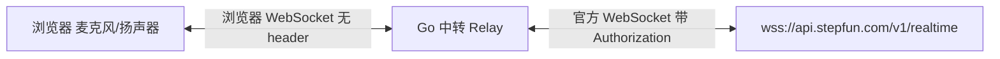

# StepFun 实时语音验证版 · 详细计划书

## 1. 一句话目标

跑通一条"麦克风说话 -> 收到 AI 语音回复并播放"的实时双向语音闭环，验证 StepFun `stepaudio-2.5-realtime` 的端到端能力与整套事件协议是否可工程化接入。

## 2. 范围

### 做（验证版内）

- 浏览器采集麦克风，低延迟推流，服务端 VAD 自动判断说话结束。
- 收 AI 音频并按块播放，支持打断时清空缓冲。
- 实时展示用户输入转写与 AI 回复转写。
- 一个"文本输入"调试通道：免麦克风也能跑通链路，并对照转写是否准确。
- VAD 开关（默认开；关掉走按键说话 `commit`/`clear`）。

### 不做（验证版外，仅备注）

- 不做长期记忆持久化：同一会话的上下文由服务端 Conversation 承担即可。
- 不做多用户、不接鉴权、不部署。本地单用户单会话。
- 不做 Tool Call / 联网搜索 / 知识库检索。

## 3. 架构



关键点：浏览器原生 WebSocket 无法自定义 header，而官方要求 `Authorization`，所以必须有后端中转，由它持有 Key 并连官方。

## 4. 技术选型

| 层 | 选择 | 理由 |
| --- | --- | --- |
| 后端 | Go 1.25 + `gorilla/websocket` | Go 优先；gorilla 心智简单、生态成熟 |
| WebSocket 库 | `github.com/gorilla/websocket` | 标准库无 WebSocket；gorilla 最通俗、资料多 |
| 前端 | Vanilla TS + `esbuild` | TS 严格类型；无框架、无 dev server，Go 直接托管编译产物 |
| 配置 | `.env` | Key 本地持有，gitignore |
| 默认模型 | `stepaudio-2.5-realtime` | 活人感/情绪/人设最强，贴合情感陪伴方向 |

## 5. 目录结构

```text
voice-demo/
  cmd/server/main.go            # 入口：读配置 -> 组装 Module -> 启动
  internal/config/config.go     # 配置能力对象（Load 一个构造入口）
  internal/realtime/types.go    # 事件契约：全部类型化结构体（数据载体）
  internal/realtime/realtime.go # Realtime 客户端能力对象（Connect/Send）
  internal/realtime/relay.go    # Relay 中转能力对象（浏览器<->官方双向桥）
  internal/server/module.go     # HTTP Server 组合器：路由 + 静态 + /ws
  web/src/types.ts              # 前端事件类型（严格模式）
  web/src/app.ts                # 页面控制器
  web/src/audio.ts              # 麦克风采集与播放封装
  web/src/worklet.ts            # AudioWorklet（PCM16 转链）
  web/index.html                # 单页
  web/build.mjs                 # esbuild 构建脚本 -> web/assets
  .env / .env.example / .gitignore
  README.md / 计划书.md
```

## 6. 事件契约（前后端 & Go 一致）

### 客户端 -> 服务端（Client Event）

- `session.update`：配置 instructions / voice / modalities / turn_detection / 工具
- `input_audio_buffer.append`：推 base64 PCM16 音频块
- `input_audio_buffer.commit`：手动提交（关 VAD 时用）
- `input_audio_buffer.clear`：清空缓冲（关 VAD，新一轮输入前）
- `conversation.item.create`：注入一条文本消息（文本调试通道）
- `response.create`：触发模型推理
- `response.cancel`：取消当前回复

### 服务端 -> 客户端（Server Event，验证版关心这些）

- `session.created` / `session.updated`
- `error`
- `input_audio_buffer.speech_started` / `speech_stopped` / `committed`
- `conversation.item.input_audio_transcription.completed`（用户转写）
- `response.created`
- `response.audio.delta` / `response.audio.done`（音频块 / 音频结束）
- `response.audio_transcript.delta` / `done`（AI 转写）
- `response.text.delta` / `response.text.done`
- `response.done`（本轮结束标志）

## 7. 分步实施（每步带验证）

1. **初始化结构与配置**：目录、go.mod、`.env*`、`.gitignore`。
   验证：`go mod init` 成功，文件齐全。
2. **计划书与 README**：本文档。
3. **Go 事件类型契约（types.go）**：所有事件类型化，`ParseServerEvent` 按 `type` 分发。
   验证：`types_test.go` 覆盖 `session.created`、`response.audio.delta`、`response.done`、`error`。
4. **Go Realtime 客户端（realtime.go）**：建立上游连接、发送各类 Client 事件。
   验证：用本地 mock WebSocket 服务端测握手与收发。
5. **Go Relay 双向中转（relay.go）**：浏览器连接 <-> 官方连接互转，处理关闭与错误映射。
   验证：mock 上游，验证客户端消息转发到上游、上游消息回传客户端、关闭传播。
6. **HTTP Server（module.go）**：`/` 静态托管、`/ws` 升级。
   验证：Handler 单测（`/` 返回页面、`/ws` 握手成功）。
7. **前端类型与构建**：`types.ts` + esbuild + tsconfig。
   验证：`tsc --noEmit` 零错误；`build.mjs` 产出 `app.js`/`worklet.js`。
8. **前端音频链路**：麦克风 worklet 采集、PCM16 分块推送、音频队列播放、打断清缓冲。
9. **端到端联调**：`go build ./...`、`go vet ./...`、`go test ./...`、启动服务、实连官方语音对话。

## 8. 配置项

| 变量 | 说明 | 默认 |
| --- | --- | --- |
| `STEPFUN_API_KEY` | 官方 Key | 无（必填） |
| `STEPFUN_URL` | 官方 WS 地址 | `wss://api.stepfun.com/v1/realtime` |
| `MODEL` | 模型 | `stepaudio-2.5-realtime` |
| `VOICE` | 音色 | `linjiajiejie` |
| `PORT` | 本地服务端口 | `8080` |

## 9. 验收标准

- 服务启动后，浏览器打开页面、授权麦克风，说话能收到并听到 AI 语音回复。
- 界面能实时看到用户转写与 AI 转写。
- 文本输入通道能直接触发文本回复（免麦克风验证链路）。
- `go build ./...`、`go vet ./...`、`go test ./...`、前端 `tsc --noEmit` 全部通过。

## 10. 风险与注意点

- 会话最长 30 分钟；`voice` 首次出音频后不可改。
- VAD 对长块音频延迟高：麦克风按 ~20-30ms 小块高频推送，且句尾留静音。
- `response.audio.done` / `response.done` **不含音频字节**，只含转写；必须攒 `response.audio.delta`。
- `.env` 含密钥，gitignore 已排除，提交历史里不得出现。
